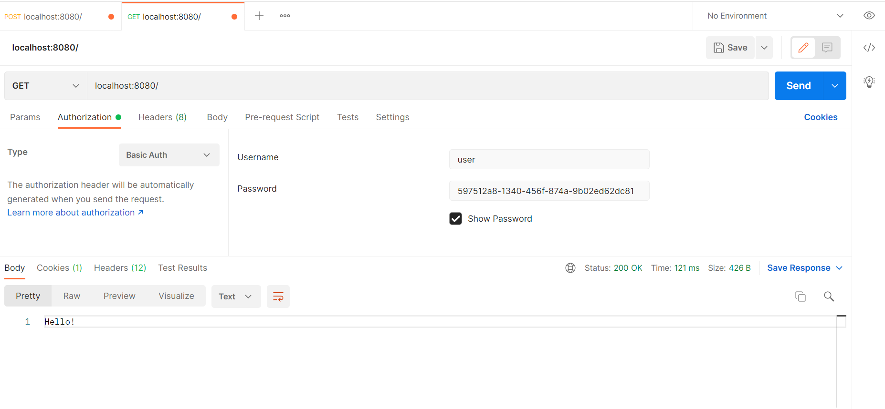

## Without Any Configuration

FLOW: 
1. 
   * REQUEST
     * GET: http://localhost:8080/
   * RESPONSE
     * 302
     * LOCATION: http://localhost:8080/login
     * SetCookie: JSESSIONID=CECEFF50F9DCA560681E6D021B58B3FE // indicates unauthenticated user
     * Path=/
     * HttpOnly 
2. 
    * REQUEST
      * GET: http://localhost:8080/login
      * HEADERS
        * Cookie : JSESSIONID=CECEFF50F9DCA560681E6D021B58B3FE // indicates unauthenticated user
    * RESPONSE
      * 200
      * LOGIN_HTML_PAGE
3.
    * REQUEST
      * POST: http://localhost:8080/login
      * HEADERS
      * Cookie : JSESSIONID=CECEFF50F9DCA560681E6D021B58B3FE
      * Form_Data
        * username=user
        * password=597512a8-1340-456f-874a-9b02ed62dc81
        * _csrf=3261da01-f853-4981-bf4c-81bdc334640f
    * RESPONSE
      * 302
      * Location: http://localhost:8080/
      * SetCookie:
        * JSESSIONID=6AEC35F1C5FADEB0695118A06996F27C // indicates authenticated user
        * Path='/'
        * HttpOnly
4.
    * REQUEST
      * GET: http://localhost:8080/
      * HEADERS
        * Cookie : JSESSIONID=6AEC35F1C5FADEB0695118A06996F27C // indicates authenticated user
    * RESPONSE
      * 200
      * Hello
